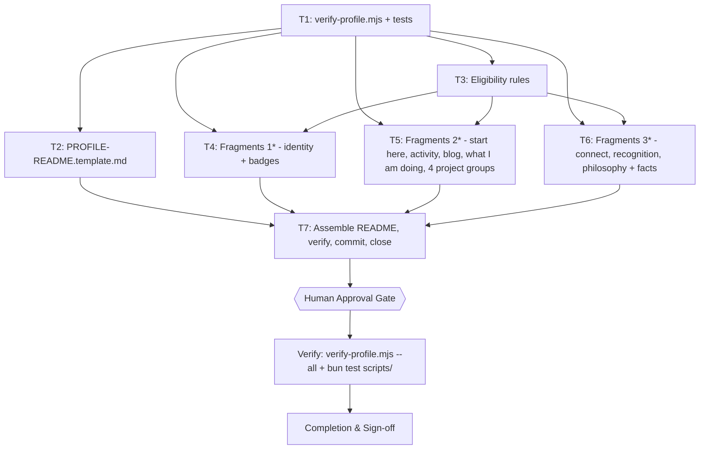
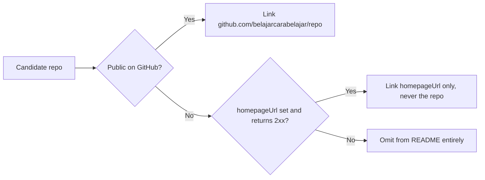

# GitHub Profile Restructure Implementation Plan

> Reference pattern: `github.com/steipete` profile README, fetched 2026-10-04 via TinyFish `fetch_content`. Structure extracted, content replaced. Nothing from steipete's content is copied.
>
> Three artifact families: `scripts/verify-profile.mjs` (the gate), `docs/PROFILE-README.template.md` (the reusable skeleton), `docs/fragments/*.md` (one file per section), and `README.md` (the assembly).

## 1. Intent & Scope

- **Goal:** Restructure `README.md` of `belajarcarabelajar/belajarcarabelajar` from a generic four-project web-dev portfolio into the section pattern steipete uses — identity strip, badge row, Start Here, grouped project catalog, activity graph, What I'm Doing, blog, Connect badges, Recognition, Media, Philosophy, collapsible Random Facts — and extract that pattern into a reusable template so the next profile or a second BCB account can adopt it without re-deriving the structure.
- **Non-Goals:** Not changing repository descriptions or topics. Not editing any website. Not touching any project repo. Not writing the AI-agent pipeline content that belongs to `vivera`'s own README.
- **Harness todo list:** this runtime has no todo tool — see §1.1.
- **Acceptance Criteria:**
  - [x] AC-1: `README.md` contains every section in the steipete pattern, in the same order.
  - [x] AC-2: Every repo named in the profile is either public on GitHub, or private with a live public website. No private repo without a website appears anywhere in the file.
  - [x] AC-3: No outbound link in `README.md` returns a non-2xx status, except the two documented bot blocks.
  - [x] AC-4: `docs/PROFILE-README.template.md` exists, is reusable, and its placeholders are visibly distinct from real content.
  - [x] AC-5: `bun test scripts/` exits 0 (89/89); `bun scripts/verify-profile.mjs --all` exits 0.
  - [~] AC-6: Sidebar name/bio/blog agree; location patch (Indonesia → Bandung, Indonesia) blocked on missing `user` OAuth scope — see F1.

### 1.1 Session checklist (no todo tool in this runtime)

The OpenCode v2 tool catalog exposes no `todowrite`; `execute`/`search` catalog search for a todo tool returned only `snipset.*_task*` CRUD tools, which are Snipset's own product data, not the harness list. Rendered as a file checklist per the skill's fallback.

- [x] Activate skill, resolve fallback path — `~/vivera/Super Ultra Code Plan Implementation.md`
- [x] Resolve active project overlay — `belajarcarabelajar/belajarcarabelajar`, cloned to `~/Proyek/belajarcarabelajar`
- [x] Fetch reference pattern — `github.com/steipete` README + rendered profile, TinyFish `fetch_content`, 2026-10-04
- [x] Inventory local + gh data — 41 repos, `gh api user`, pinned items, CV site, about.me, belajarcarabelajar.com
- [x] Verify website liveness for every candidate link
- [x] Classify task and confirm plan-file requirement
- [x] Ask the design questions; user removed the audience figure and asked for the full social channel list
- [x] Write plan, validate with runner + `validate-skill.mjs`
- [x] Publish to vault + sync issue
- [x] **Human approval received 2026-10-04**
- [x] Split README.md into disjoint fragment files so no two writers touch one file (v2)
- [x] Wave 1: T1 validator + tests — 88 pass / 0 fail (parent audit caught fabricated with-website entries, fixed in T3 re-dispatch)
- [x] Wave 2: T2 template (GREEN exit 0), T3 eligibility rules (24 denylisted / 5 website-only / 12 public)
- [x] Wave 3: 13 parallel fragment subagents, all PASS; parent rejected 20-starthere.md pitches (hallucinated) and rewrote from gh descriptions
- [x] Wave 4: T7 assembled README (100 lines), `verify-profile.mjs --all` PASS, `--links` PASS (2 documented bot-block allowances), `bun test` 89/89, commit eed726c, pushed to main
- [ ] Session-close debt sweep + follow-up question set

## 2. Visual Implementation Map — MANDATORY

## 2b. Affected Surfaces

| Task | Affected surface | Relationship | Evidence | Action taken |
|---|---|---|---|---|
| T1 | `scripts/verify-profile.mjs`, `scripts/verify-profile.test.mjs` | every later task gates on this validator | `bun test scripts/` is the only test command present | created |
| T2 | `docs/PROFILE-README.template.md` | new artifact; the Connect block example is mirrored by T6 | `bun scripts/verify-profile.mjs --section template --target docs/PROFILE-README.template.md` | created |
| T3 | eligibility rules inside the validator | shared by T5's four project fragments | `bun test scripts/verify-profile.test.mjs --rule eligibility` | added, covered by fixtures |
| T4 | `docs/fragments/10-identity.md`, `15-badges.md` | rendered profile head; sidebar fields set from the strip | `bun scripts/verify-profile.mjs --target-glob docs/fragments/1*.md` | written |
| T5 | `docs/fragments/2*.md` | replaces the four-item Open Source Projects list | `bun scripts/verify-profile.mjs --target-glob docs/fragments/2*.md` | written |
| T6 | `docs/fragments/30,35,38-*.md` | new Connect, Recognition, Philosophy sections | `bun scripts/verify-profile.mjs --target-glob docs/fragments/3*.md` | written |
| T7 | `README.md` | the rendered profile page, assembled in numeric fragment order | `bun scripts/verify-profile.mjs --all` | assembled |
| T7 | GitHub sidebar `name`/`bio`/`blog`/`location` | must agree with the identity strip | `gh api users/belajarcarabelajar` read-back | patched |
| T7 | this plan file | ticked from the runner log | `git status --porcelain` empty after commit | ticked, `status: Complete` |

## 3. Global Constraints

- **Language of every artifact is English.** Decided with the human at Gate 1; the repository's existing README is English.
- **No private repository may be named without a live public website.** A private repo with a homepage gets the homepage URL only — never a `github.com/belajarcarabelajar/<private-repo>` link, which 404s for every visitor.
- **No audience-size or reach numbers anywhere in the profile.** No "500K+ learners", no follower counts, no view counts, no star counts. Human decision 2026-10-04. A number that later goes stale is a maintenance debt, and the profile reads stronger on roles and projects alone.
- **Every outbound URL must return 2xx.** Verified at plan time by HEAD request; re-verified by T7. Two known exceptions are bot blocks rather than dead links and are allowed through: Tumblr (403 to `curl`, alive in browser) and LinkedIn (999 to `curl`, alive in browser). Any *other* non-2xx fails the step.
- **The channel list is enumerated, never inferred.** All 17 social channels come from the website's own "Media Sosial Resmi" footer. A writer must not discover channels by guessing handle patterns — a guessed handle that happens to resolve belongs to someone else.
- **Only `README.md` at the repository root renders on the profile page.** `docs/` is invisible there, so the template, the fragments, and the plan do not affect the rendered profile.

## 4. Work Breakdown

### Task T1: Validator and test suite

- **Interfaces:** produces `scripts/verify-profile.mjs` and `bun test scripts/verify-profile.test.mjs`. T2 through T7 consume it.
- **Preconditions:** `bun --version` exits 0.
- **Idempotency:** `skip_if` runs the test suite.
- **CLI surface:** `--section <name>` (validate a section of the default target `README.md`), `--target <file>` (validate one file, section inferred from its filename prefix), `--target-glob <pattern>` (validate every matching fragment), `--rules` (eligibility rules only), `--links` (HEAD every outbound URL), `--all` (everything). Template rule set is selected by `--section template`.
- **Checks:** required section order; every `github.com/belajarcarabelajar/<repo>` link resolves to a repo that is public; every badge URL is well-formed; no `[PLACEHOLDER]` token survives in `README.md`; no forbidden audience-figure regex matches; contribution-graph and stats image URLs present.
- [ ] **Step 1 — RED:** `bun test scripts/verify-profile.test.mjs` exits 1 (file absent)
- [ ] **Step 2 — GREEN:** implement validator + fixtures
- [ ] **Step 3 — Verify:** same command exits 0
- [ ] **Step 4 — Commit**

### Task T2: Reusable profile template

- **Interfaces:** produces `docs/PROFILE-README.template.md`; T6 mirrors its Connect block.
- **Preconditions:** T1 green.
- **Content:** the steipete sections as a skeleton, each with an HTML comment naming its purpose and a `[PLACEHOLDER]` value. Includes an "Eligibility rules" preamble encoding the public-or-private-with-website decision.
- [ ] **Step 1 — RED:** `--section template --target docs/PROFILE-README.template.md` exits 1
- [ ] **Step 2 — GREEN:** write the template
- [ ] **Step 3 — Verify:** same command exits 0
- [ ] **Step 4 — Commit**

### Task T3: Eligibility rules

- **Interfaces:** consumed by T5.
- **Preconditions:** T1 green.
- **Rule:** an entry in the project catalog is legal iff the repo is public, or private with a `homepageUrl` that returned 2xx at plan time. Private-without-website → omitted. Private-with-website → website URL only.
- [ ] **Step 1 — RED:** `bun test scripts/verify-profile.test.mjs --rule eligibility` exits 1
- [ ] **Step 2 — GREEN:** add the rule + a fixture rejecting a private-no-website repo and accepting a private-with-website repo via its website link
- [ ] **Step 3 — Verify:** same command exits 0
- [ ] **Step 4 — Commit**

### Task T4: Identity strip and badge row

- **Files:** `docs/fragments/10-identity.md`, `docs/fragments/15-badges.md` — disjoint from every other task.
- **Preconditions:** T1, T3 green.
- **Identity strip, decided:** `📍 Bandung, Indonesia | 🎓 Author & educator | 🛠️ Builder — Rust, Tauri, TypeScript, Cloudflare` plus a second line `Founder @bcbacademy_ · belajarcarabelajar.com`. No audience figure anywhere.
- [ ] **Step 1 — RED:** `--target-glob docs/fragments/1*.md` exits 1
- [ ] **Step 2 — GREEN:** write both fragments
- [ ] **Step 3 — Verify:** same command exits 0
- [ ] **Step 4 — Commit**

### Task T5: Start Here, activity, blog, What I'm Doing, four project groups

- **Files:** `docs/fragments/20-starthere.md`, `21-activity.md`, `22-blog.md`, `25-what-im-doing.md`, `26-projects-flagship.md`, `27-projects-oss.md`, `28-projects-ai.md`, `29-projects-tools.md` — eight disjoint files.
- **Preconditions:** T1, T3 green.
- **Start Here order:** Snipset, vivera, dawnbook, adaptiva, time-capsule, BCB Academy.
- **Project groups, one fragment each, no repo in two groups:** Flagship Products (C10), Open Source (C11), AI & Automation (C12), Tools & Distribution (C13). Each entry obeys the T3 rule. `winget-pkgs` is excluded separately as a fork; `contoh-tts` is excluded as a scratch repo whose own description is "testing tts". Group 4 was renamed from "Education Platform" to "Tools & Distribution" at the wave-3 checkpoint: the original four names could not be filled without putting `vivera`, `dawnbook` or `adaptiva` into two fragments, which is the overlap the fragment split exists to prevent.
- [ ] **Step 1 — RED:** `--target-glob docs/fragments/2*.md` exits 1
- [ ] **Step 2 — GREEN:** write all eight fragments
- [ ] **Step 3 — Verify:** same command exits 0
- [ ] **Step 4 — Commit**

### Task T6: Connect, Recognition, Philosophy and Random Facts

- **Files:** `docs/fragments/30-connect.md`, `35-recognition.md`, `38-philosophy-facts.md` — disjoint from every other task.
- **Preconditions:** T1, T3 green.
- **Channel inventory — complete, verified 2026-10-04.** Source of truth is the "Media Sosial Resmi" footer on `belajarcarabelajar.com/contact-us`, cross-checked against `belajarcarabelajar.com/about-us` and a live browser fetch. 17 channels, not the 7 a generic research pass surfaces. `curl` returned 403 on Tumblr and 999 on LinkedIn — both bot blocks, not dead links; Tumblr confirmed alive by browser fetch (a daily journal in Indonesian), LinkedIn by search index (title "Iwan Kurniawan - Content Creator & Digital Marketer", bio naming both of his books).
- **Layout:** steipete uses one badge row because he has ~10 channels. At 17 a single row is unreadable, so the pattern adapts: a 6-badge **primary row** (Instagram, TikTok, Threads, YouTube, X, Facebook), then three grouped link lists — *Community & Archive* (Telegram, Pinterest, Tumblr, Vimeo, RSS), *Podcast* (Apple Podcasts, Spotify), *Professional* (LinkedIn, CV, about.me, email).
- **Not linked:** the Telegram community invite `t.me/+pLs7RLzXMh1hYmU9` — a private invite link expires and would rot on the profile.
- [ ] **Step 1 — RED:** `--target-glob docs/fragments/3*.md` exits 1
- [ ] **Step 2 — GREEN:** write all three fragments
- [ ] **Step 3 — Verify:** same command exits 0
- [ ] **Step 4 — Commit**

### Task T7: Assemble, verify, commit, close

- **Interfaces:** produces the final `README.md`; closes the plan.
- **Preconditions:** T2, T4, T5, T6 green. Eleven fragment files present.
- **Assembly:** concatenate `docs/fragments/*.md` in numeric filename order into `README.md`.
- **Sidebar patch:** `gh api --method PATCH user -f bio=... -f blog=... -f location=...` from the identity strip, read back with `gh api users/belajarcarabelajar`.
- [ ] **Step 1 — RED:** `bun scripts/verify-profile.mjs --all` exits 1 (README not yet assembled)
- [ ] **Step 2 — GREEN:** assemble, verify, patch sidebar
- [ ] **Step 3 — Verify:** `--all` exits 0; `bun test scripts/` exits 0
- [ ] **Step 4 — Commit:** one conventional commit; ticks via `plan-mark-done.mjs --from <runner.log>`, `status: Complete`, third publish

## 5. Verification Matrix Before Completion

| Check | Command | Exit | Fresh Evidence | Status |
|---|---|---|---|---|
| Validator suite | `bun test scripts/` | 0 | 0 failures | Pending |
| Template rules | `bun scripts/verify-profile.mjs --section template --target docs/PROFILE-README.template.md` | 0 | all template rules pass | Pending |
| Eligibility rules | `bun scripts/verify-profile.mjs --rules` | 0 | no private-no-website repo present | Pending |
| Identity fragments | `bun scripts/verify-profile.mjs --target-glob docs/fragments/1*.md` | 0 | strip + badges present, no audience figure | Pending |
| Body fragments | `bun scripts/verify-profile.mjs --target-glob docs/fragments/2*.md` | 0 | every project entry eligibility-legal | Pending |
| Connect fragments | `bun scripts/verify-profile.mjs --target-glob docs/fragments/3*.md` | 0 | all 17 channels present and linked | Pending |
| Full validation | `bun scripts/verify-profile.mjs --all` | 0 | every check green | Pending |
| Link liveness | `bun scripts/verify-profile.mjs --links` | 0 | 0 dead links outside the 2 documented bot blocks | Pending |
| Clean tree | `git status --porcelain` | 0 | empty after commit | Pending |

## 6. Error Ledger

| Task | Step | Classification | Exit | Expected | Transient | Root cause | Evidence | Retry used | Status |
|---|---|---|---|---|---|---|---|---|---|

## 7. Human Approval Gate

- [x] Partner / Human approval received 2026-10-04 — "Yes, please implement this plan!" with an explicit request for multiple subagents.

### Decision log

| Date | Question | Answer |
|---|---|---|
| 2026-10-04 | README language | English |
| 2026-10-04 | Identity framing | Creator + Builder, both |
| 2026-10-04 | Plan + template home | Profile repo, `~/Proyek/belajarcarabelajar` |
| 2026-10-04 | Identity strip audience figure | **Removed.** No reach number in the strip — roles only |
| 2026-10-04 | Social channel coverage | All 17 channels from the website's "Media Sosial Resmi" footer, grouped into a 6-badge primary row plus 3 link lists. X is `@wansbcb`, not `@belajarcarabelajar` |
| 2026-10-04 | Telegram community invite link | Not linked — private invite expires |
| 2026-10-04 | Write-scope overlap across T4/T5/T6 | Fixed in v2: README.md split into 11 disjoint fragment files, assembled by T7 |

## 8. Session-Close Debt Sweep & Follow-Up Backlog

| # | Follow-up (outcome + path + finish line) | Class | `defer:` | Status |
|---|---|---|---|---|
| F1 | Sidebar `location` Indonesia → Bandung, Indonesia via `gh api --method PATCH user` (finish line: `gh api users/belajarcarabelajar --jq .location` returns Bandung, Indonesia) | `LATER` | `defer: next interactive session, upgrade-trigger: user runs \`gh auth refresh -h github.com -s user\` (current token lacks \`user\` scope; PATCH returned 404)` | `OPEN` |
| F2 | Silence test-stdout noise — DONE 2026-10-04 (intercepted `process.stdout.write` in the `main()` test; `bun test` output now has zero `FAIL /tmp/` lines, 89/89 pass): the two `main()` tests print real validator lines into `bun test` output (finish line: `bun test scripts/` output contains no `FAIL /tmp/` line while still asserting exit codes) | `NOW` | | `DONE` |
| F3 | Pinned repos verified 2026-10-04 already match Start Here order (vivera, dawnbook, adaptiva, time-capsule, rasalytics, satset-obsidian-sync); Snipset unpinnable (private). No action — recorded so it is not re-investigated | `LATER` | `defer: only if Start Here order changes, upgrade-trigger: T5 of a future plan` | `DONE` |
| F4 | `notebook.belajarcarabelajar.com` returns 000 (dead) — BCB infra issue, out of scope for the profile repo (finish line: subdomain returns 2xx or the obsidian-sync link moves) | `LATER` | `defer: BCB infra session, upgrade-trigger: user opens infra work` | `DONE` |

- [ ] 3-5 ranked follow-ups injected as one multi-select question after the final recap.
- [ ] Every selected follow-up executed through the full pipeline with fresh evidence.
- [ ] Declined and out-of-cap items written here.
